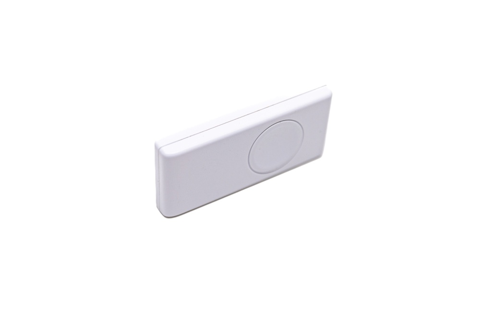
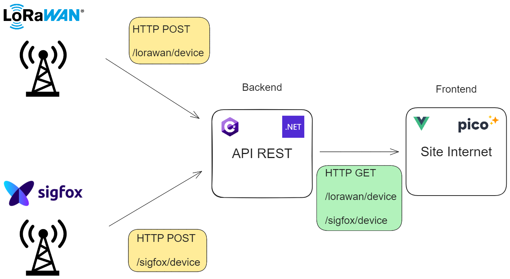

# Buttontester

This is a web application that tests the network eligibility for Sigfox and LoRaWAN. The application is built using Vue.js for the frontend, Pico CSS for styling, and C# with .NET for the backend.

To use the application, simply click on the button and it will perform a network eligibility test. The results will be displayed on the screen, indicating whether the network is eligible for Sigfox and LoRaWAN or not.

Feel free to explore the code and make any modifications as needed. If you have any questions or need further assistance, please don't hesitate to reach out.

This project was developed as part of a internship at IO CONNECT Solutions. All rights reserved.

# Authors: 
- [Franck VALMONT] (https://github.com/Franck1vlt)
- [Raphël PAYET] (https://github.com/RaphaelPayet)
- [Marc HAM-CHOU-CHONG] (https://github.com/Marc-HamChouChong)

